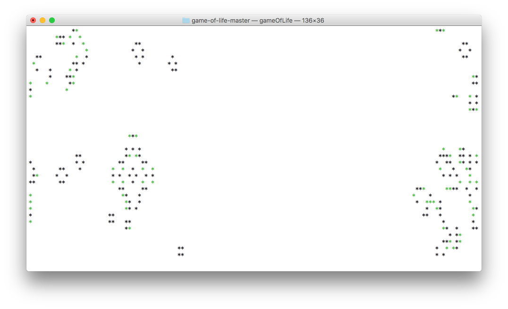
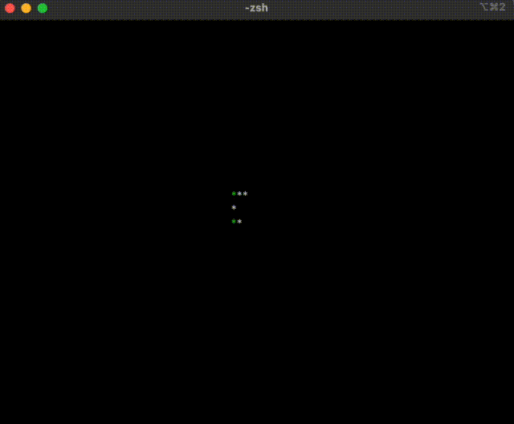

## Game of Life

A Haskel implementation of a cellular automaton game. The game of life is a zero player game, thus, the way how the game process develops is determined by the game's initial state.


In this implementation of the game newly created cells are green, while those survived one or more rounds are of the default colour.



To change the game's initial state modify _init.txt_, while an asterisk means that a cell is alive, a space represents a dead cell. 

To execute the game:
```
runghc gameOfLife.hs
```
To compile and execute:
```
ghc gameOfLife.hs
./gameOfLife
```

If you want to find interesting patterns, you can start here: https://en.wikipedia.org/wiki/Conway's_Game_of_Life